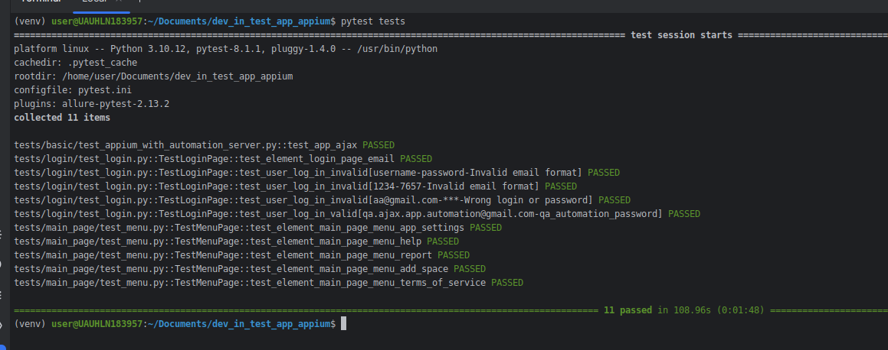

### Setup environment
Instructions from Appium https://appium.io/docs/en/2.5/quickstart/

- install Java (OpenJDK) 
- install Node.JS
- install Appium https://appium.io/docs/en/2.1/quickstart/install/
- install UIAutomator2 https://github.com/appium/appium-uiautomator2-driver
- install Android Studio and Android SDK https://developer.android.com/studio
- add to global vars ANDROID_HOME and ANDROID_SDK_ROOT

    _for Ubuntu:_ \
    `$ vim ~/.bashrc` \
    _Add following lines_ \
    `export ANDROID_HOME=$HOME/Android/Sdk` \
    `export PATH=$PATH:$ANDROID_HOME/tools:$ANDROID_HOME/platform-tools` \

- optionally - install Appium Inspector https://github.com/appium/appium-inspector/releases
- create file [settings.ini](settings.ini) in the project root dir with values: \
`[settings]` \
`LOGIN=<LOGIN>` \
`PASSWORD=<PASSWORD>` 

Test results, see info.log and debug.log in the project root \

